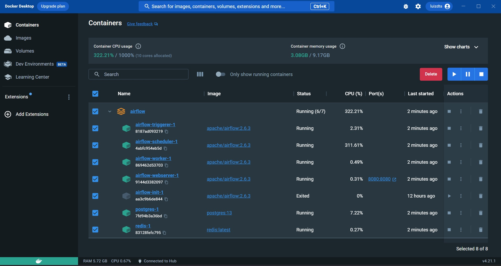
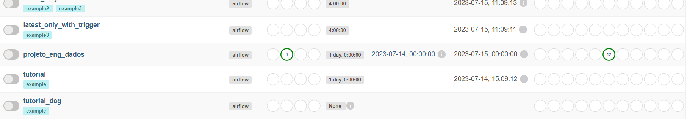
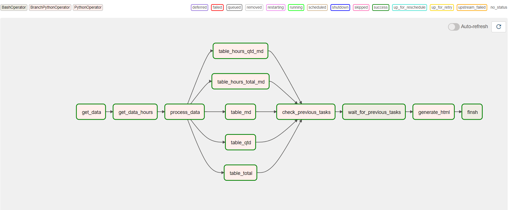

# UNIVERSIDADE FEDERAL DO RIO GRANDE DO NORTE

# CENTRO DE TECNOLOGIA

# DEPARTAMENTO DE COMPUTAÇÃO E AUTOMAÇÃO - DCA

# ENGENHARIA DE DADOS - DCA0132 - 2023.1
- Equipe: Guilherme Pablo de Santana Maciel e Luiz Henrique Araújo Dantas

# Projeto final - Estudo da ferramenta Apache Airflow: Pix com Apache Airflow

## Motivação

A motivação para o desenvolvimento desse projeto é verificar os dados que são criados diariamente do Pix com o auxílio da API do Banco Central do Brasil (BCB), nesse projeto iremos especificar como que foi criada a infraestrutura utilizando Docker, as DAGs feitas com os dados vindos da API e os resultados que podem ser vistos a partir de gráficos que são gerados a partir dos dados obtidos.

## Ferramentas
- Principais ferramentas utilizadas: Apache Airflow, Docker e Python.

## Infraestrutura

 :warning: É necessário que você tenha no seu computador o Docker já instalado, para Windows recomenda-se utilizar o Docker Desktop, ferramenta que é disponibilizada gratuitamente no próprio site do Docker, enquanto nas distro Linux é possível instalá-lo via linha de comando no terminal.

 :warning: É possível que o projeto não execute se você tiver outras instâncias já abertas do Airflow no seu computador ou imagens e conteúdos já baixados, recomendamos que você EXCLUA todas as imagens e contêineres existentes relacionados ao Apache Airflow, para que o projeto execute de maneira limpa e eficiente.

 :warning: Para reiniciar a aplicação deve-se utilizar novamente o comando <code>docker-compose up</code> na pasta que está o projeto para que seja possível reiniciar as DAGs.

A imagem que contém o Docker-compose para instalar os recursos localmente pode ser obtida gratuitamente clicando no [link](https://airflow.apache.org/docs/apache-airflow/2.6.3/docker-compose.yaml).
 
- Instalação
    - Para executar o projeto, deve-se possuir o Docker instalado na máquina local, a partir dele que iremos executar a imagem disponibilizada anteriormente.
    Com os comandos abaixo, podemos utilizar o docker compose para iniciar o projeto:

        <code>
        docker-compose up airflow-init
        </code>

        Para iniciar o serviço, basta executar o seguinte comando:

        <code>
        docker-compose up 
        </code>

        Para finalizar o serviço, basta executar o seguinte comando:

        <code>
        docker-compose down 
        </code>

    - Para execução do projeto, deve-se criar três pastas localmente, que servirão como persistência para o serviço, o acesso dessas pastas é nativo da imagem Docker do Apache Airflow que devem ser criadas para que se possa realizar qualquer persistência de arquivos no serviço.
    As pastas que devem ser criadas são:
        - logs
        - plugins
        - config
        - dags

        Esses diretórios servirão para que quaisquer arquivos que sejam gerados na aplicação possam estar acessíveis localmente, como é o caso desse projeto, onde serão criadas imagens e uma página HTML que contém a visualização dos gráficos relacionados aos dados do Pix.

    - Com o serviço on-line, é necessário utilizar a palavra 'airflow' para o login e senha na página que está exposta no ambiente local pela porta 8080.

## Desenvolvimento do Projeto

Com a configuração do serviço finalizada, podemos criar o script necessário para iniciar as tasks que irão ser executadas na base de dados.

Com isso, podemos criar funções para realizar o tratamento de dados que são obtidos a partir da API, para esse projeto criamos as seguintes funções:

    - formatar_eixo_x(data):
    - get_data(): Função que acessa a API e retorna, por meio de uma requisição, o valor da data e o transforma em um dataframe.
    - get_data_hours(): Função que acessa a partir da API e retorna, por meio de uma requisição, as horas do dia e transforma em um dataframe.
    - process_data(): Função de processamento de dados, é realizado um tratamento de dados para que os valores relacionados à data, hora, quantidade de Pix, total do valor de Pix, as médias das quantidades, totais diários dos valores possam ser utilizados para as tasks.
    - table_total(ti): Tabela que retorna o valor total das transferências Pix realizadas no dia.
    - table_qtd(ti): Tabela que retorna a quantidade de transferências Pix realizadas em um determinado dia.
    - table_md(ti): Tabela que retorna o valor médio geral do Pix em um determinado dia.
    - table_hours_total_md(ti): Tabela responsável por retornar o valor médio do Pix em um determinado horário.
    - table_hours_qtd_md(ti): Tabela responsável por trazer a quantidade média de Pix realizados por um determinado horário.
    - generate_html(ti): Gera a página HTML que contém os gráficos interativos com os dados já tratados vindos da API.
    - check_previous_tasks(ti): função que realiza uma checagem em outras as outras funções que determina se elas já foram realizadas e obtiveram sucesso na execução, se não, elas entram em estado de espera enquanto alguma outra função finaliza sua operação e gera o HTML.

Após a definição de cada uma das funções, a DAG inicia-se a partir do trecho do código da linha 522, onde serão utilizados os operadores PythonOperator, BashOperator e BranchPythonOperator

        - PythonOperator: Operador que executa uma função Python como tarefa no fluxo de trabalho, permite a execução e escrita de códigos Python dentro do Airflow.
        - BashOperator: Operador que realiza comandos bash como uma tarefa no fluxo de trabalho, nele podem ser executados comandos do sistema operacional, scripts bash ou comandos executáveis do Airflow.
        - BranchPythonOperator: Operador que executa uma função Python para determinar qual caminho seguir no fluxo de trabalho com base em uma condição, essa função irá retornar um id da próxima tarefa a ser executada.

As atualizações dos dados são realizadas a cada trinta minutos, como está especificado nos argumentos padrões (default_args), lá podemos alterar a data que é iniciada o fluxo de trabalho com os dados.

## Conjunto de dados e API utilizada
    
- API para dados diários de PIX liquidados ao final de cada dia desde a criação do Sistema de Pagamentos Instantâneos (SPI): https://olinda.bcb.gov.br/olinda/servico/SPI/versao/v1/aplicacao#!/recursos/PixLiquidadosAtual

## Resultados obtidos

As imagens abaixo mostram, respectivamente, a infraestrutura que ficará no Docker Desktop, o painel de DAGs existentes, histórico de execução e o grafo da DAG executada.

